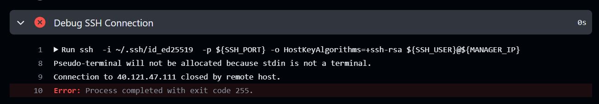
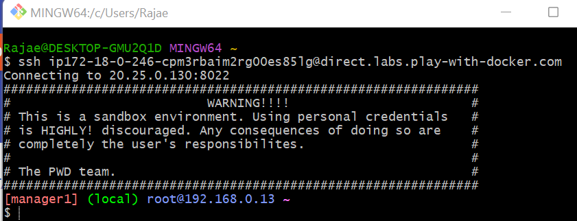

### Task 1: CI/CD on a Docker Swarm Cluster
This task demonstrates the process of setting up a CI/CD pipeline that builds and deploys a web application to a Docker Swarm cluster using GitHub Actions. The steps include setting up a GitHub repository, configuring a CI/CD pipeline, deploying the application to Docker Swarm on Play with Docker (PWD), and ensuring the application is accessible.
##### Requirements
- The project must be hosted on a private GitHub repository.
- The repository must contain a basic HTML web app.
- A CI/CD pipeline must be configured using GitHub Actions.
- The app must be deployed to a Docker Swarm cluster on Play with Docker (PWD).
##### Steps
1. **Create a Private GitHub Repository**
2. **Inside the repository, create the index.html**
3. **Create the Dockerfile to serve the HTML file using a lightweight web server (e.g., Nginx)**
4. **Add DOCKER_USERNAME and DOCKER_TOKEN as repository secrets**
5. **Set Up Docker Swarm Cluster**
   - Visit Play with Docker and start a new session.
   - Create one manager and one worker node.
   - Record the IP addresses of both nodes.


6. **CI/CD Pipeline with GitHub Actions**
   - In the .github/workflows directory of your repository, create the ci-cd.yml workflow file.
   - Create the docker-compose.yml file.
   - Configure the workflow to trigger on push events to the index.html file.
   - Build and Push Docker Image.
   - Deploy the Application.
##### docker-compose.yml
```yaml
version: '3.8'  # Specifies the version of the Docker Compose file format

services:  # Defines the services that will be run in the Docker Swarm stack
  webapp:  # The name of the service
    image: ${{ secrets.DOCKER_USERNAME }}/docker-swarm-webapp:latest  # Specifies the Docker image to use for this service
    deploy:  # Deployment configuration for the service
      placement:  # Placement configuration for the service
        constraints:  # Constraints on where the service can be deployed
          - node.role == worker  # Ensures that the service runs only on worker nodes
    ports:  # Port mappings for the service
      - 80:80  # Maps port 80 of the host to port 80 of the container
```
##### ci-cd pipeline
```yaml
name: CI/CD Pipeline

# Trigger the pipeline on push events to the 'index.html' file
on:
  push:
    paths:
      - 'index.html'

# Define environment variables for SSH connection
env:
  MANAGER_IP: 20.25.0.130
  SSH_USER: root
  SSH_PORT: 8022

jobs:
  # Define the build job
  build:
    runs-on: ubuntu-latest  # Use the latest Ubuntu runner

    steps:
      # Step to check out the repository code
      - name: Checkout repository
        uses: actions/checkout@v2

      # Step to set up Docker Buildx, a Docker CLI plugin for extended build capabilities
      - name: Set up Docker Buildx
        uses: docker/setup-buildx-action@v1

      # Step to log in to Docker Hub using secrets for username and token
      - name: Login to Docker Hub
        uses: docker/login-action@v2
        with:
          username: ${{ secrets.DOCKER_USERNAME }}
          password: ${{ secrets.DOCKER_TOKEN }}

      # Step to build and push the Docker image to Docker Hub
      - name: Build and push Docker image
        run: |
          docker build -t ${{ secrets.DOCKER_USERNAME }}/docker-swarm-webapp:latest .
          docker push ${{ secrets.DOCKER_USERNAME }}/docker-swarm-webapp:latest

  # Define the deploy job, which depends on the build job
  deploy:
    runs-on: ubuntu-latest  # Use the latest Ubuntu runner
    needs: build  # Ensure this job runs after the build job

    steps:
      # Step to generate an SSH key pair for secure server access
      - name: Generate SSH Key Pair
        run: |
          mkdir -p ~/.ssh
          ssh-keygen -t ed25519 -P "" -f ~/.ssh/id_ed25519
          echo "SSH Key Pair Generated Successfully"

      # Step to add the remote server to known hosts to avoid SSH prompts
      - name: Add remote server to known hosts
        run: |
          ssh-keyscan -p ${SSH_PORT} -H ${MANAGER_IP} >> ~/.ssh/known_hosts
          echo "Remote server added to known hosts"

      # Step to deploy the Docker image to Docker Swarm on the remote server
      - name: Deploy to Docker Swarm
        run: |
          # Log in to Docker Hub on the remote server
          ssh -i ~/.ssh/id_ed25519 -o StrictHostKeyChecking=yes -p ${SSH_PORT} -o HostKeyAlgorithms=+ssh-rsa ${SSH_USER}@${MANAGER_IP} "docker login -u ${{ secrets.DOCKER_USERNAME }} -p ${{ secrets.DOCKER_TOKEN }}"
          # Pull the latest Docker image on the remote server
          ssh -i ~/.ssh/id_ed25519 -o StrictHostKeyChecking=yes -p ${SSH_PORT} -o HostKeyAlgorithms=+ssh-rsa ${SSH_USER}@${MANAGER_IP} "docker pull ${{ secrets.DOCKER_USERNAME }}/docker-swarm-webapp:latest"
          # Deploy the Docker stack using docker-compose.yml
          ssh -i ~/.ssh/id_ed25519 -o StrictHostKeyChecking=yes -p ${SSH_PORT} -o HostKeyAlgorithms=+ssh-rsa ${SSH_USER}@${MANAGER_IP} "docker stack deploy -c docker-compose.yml webapp_stack"
```
#### Output:
- **Build Job**
The build job in this CI/CD pipeline starts by checking out the repository code using the actions/checkout@v2 action to ensure the latest code is available. It then sets up Docker Buildx with the docker/setup-buildx-action@v1 action, enabling advanced Docker build capabilities. Following this, the pipeline logs into Docker Hub using the docker/login-action@v2 action, securely managing credentials through GitHub secrets. Finally, it builds the Docker image tagged as latest using the docker build command and pushes this image to Docker Hub, confirming the image is successfully built and available in the Docker registry.

- **Deploy Job**
The deploy job, which depends on the successful completion of the build job, begins by generating an SSH key pair for secure access to the remote server using the ssh-keygen command. It then adds the remote server to the known hosts list with the ssh-keyscan command to avoid SSH prompts during deployment. The deployment process involves logging into Docker Hub on the remote server via SSH, pulling the latest Docker image from Docker Hub to the remote server, and deploying the Docker stack using the docker stack deploy command with the docker-compose.yml file.
- Unfortunately, the SSH connection to the Docker Swarm manager is being established successfully, but it closes immediately after authentication, and I am still encountering the same problem. 

However, when I tried to SSH using Git on my laptop, it worked correctly.

### Task 2: Algorithmic Challenge
The following code snippets demonstrate how to print numbers from 1 to 100 with specific words replacing multiples of 3, 5, and 7.

##### Python
```python
# Loop through numbers 1 to 100
for i in range(1, 101):
    output = ""
    
    # Check if the number is a multiple of 3
    if i % 3 == 0:
        output += "Hello"
    
    # Check if the number is a multiple of 5
    if i % 5 == 0:
        output += "World"
    
    # Check if the number is a multiple of 7
    if i % 7 == 0:
        output += "Yoo"
    
    # If the number is not a multiple of 3, 5, or 7, set output to the number
    if output == "":
        output = i
    
    # Print the output, followed by a comma and space
    print(output, end=", ")
```
#### Output:
```plaintext
1, 2, Hello, 4, World, Hello, Yoo, 8, Hello, World, 11, Hello, 13, Yoo, HelloWorld, 16, 17, Hello, 19, World, HelloYoo, 22, 23, Hello, 25, World, Hello, 28, 29, HelloWorld, 31, 32, Hello, 34, WorldYoo, Hello, 37, 38, Hello, 40, World, HelloYoo, 43, 44, Hello, World, 47, Hello, Yoo, 50, HelloWorld, 52, 53, Hello, 55, World, HelloYoo, 58, 59, Hello, 61, 62, HelloWorld, 64, 65, Hello, 67, WorldYoo, Hello, 70, 71, Hello, 73, World, HelloYoo, 76, 77, Hello, World, 80, Hello, Yoo, 82, 83, HelloWorld, 85, 86, Hello, 88, World, HelloYoo, 91, 92, Hello, 94, World, Hello, 97, Yoo, HelloWorld, 100,
```
##### java
```java
public class Main {
    public static void main(String[] args) {
        // Loop through numbers 1 to 100
        for (int i = 1; i <= 100; i++) {
            String output = "";

            // Check if the number is a multiple of 3
            if (i % 3 == 0) {
                output += "Hello";
            }

            // Check if the number is a multiple of 5
            if (i % 5 == 0) {
                output += "World";
            }

            // Check if the number is a multiple of 7
            if (i % 7 == 0) {
                output += "Yoo";
            }

            // If the number is not a multiple of 3, 5, or 7, set output to the number
            if (output.isEmpty()) {
                output = Integer.toString(i);
            }

            // Print the output, followed by a comma and space
            System.out.print(output + ", ");
        }
    }
}
```
#### Output:
```plaintext
1, 2, Hello, 4, World, Hello, Yoo, 8, Hello, World, 11, Hello, 13, Yoo, HelloWorld, 16, 17, Hello, 19, World, HelloYoo, 22, 23, Hello, 25, World, Hello, 28, 29, HelloWorld, 31, 32, Hello, 34, WorldYoo, Hello, 37, 38, Hello, 40, World, HelloYoo, 43, 44, Hello, World, 47, Hello, Yoo, 50, HelloWorld, 52, 53, Hello, 55, World, HelloYoo, 58, 59, Hello, 61, 62, HelloWorld, 64, 65, Hello, 67, WorldYoo, Hello, 70, 71, Hello, 73, World, HelloYoo, 76, 77, Hello, World, 80, Hello, Yoo, 82, 83, HelloWorld, 85, 86, Hello, 88, World, HelloYoo, 91, 92, Hello, 94, World, Hello, 97, Yoo, HelloWorld, 100,
```
### Task 3: Logic
Since he calls me first for help, I can infer that either I am close to him and aware of his direction, or perhaps we both headed in the same direction. In either case, one of us is leading the way. If I'm trailing behind, I'll set a known maximum distance beyond which it's unlikely for my friend to be. Then, I'll proceed in my direction until I reach that distance, ensuring to mark my starting point beforehand. If I haven't spotted the red car during this journey, I'll switch directions and return to the starting point. From there, I'll choose the other direction, and set an other known maximum distance, until I reunite with my friend.
